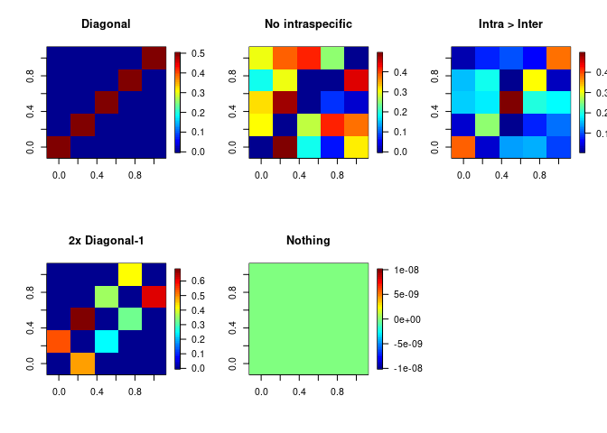
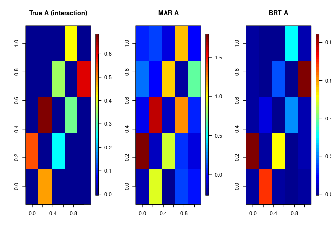
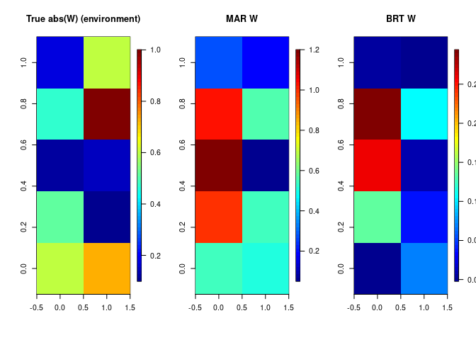
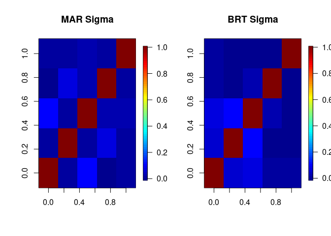
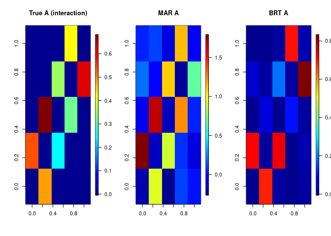
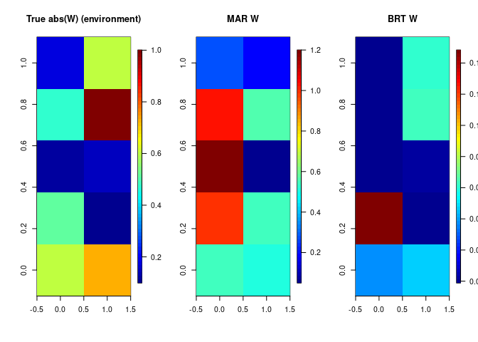
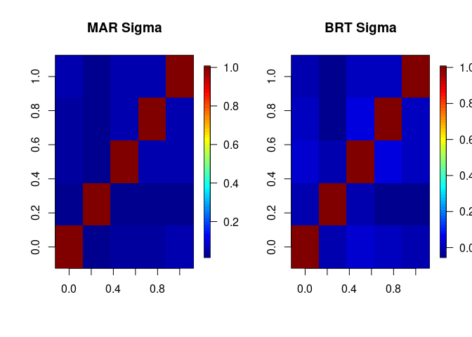

# Example of outputs
## Let's try a few different interaction matrices


```r
N = 5
A1 = diag(0.5,N)
A2 = matrix(runif(N**2, 0, 0.5), N, N)
diag(A2) = 0.0
A3 = matrix(runif(N**2, 0, 0.2), N, N)
diag(A3) = runif(N, 0.25, 0.5)
A4 = diag(0.0, N)
for(i in 1:(N-1)) {
  A4[i+1, i] = runif(1, 0, 0.7)
  A4[i, i+1] = runif(1, 0, 0.7)
}
A5 = diag(0.0, N)
par(mfrow = c(2,3))
fields::image.plot(A1, main="Diagonal")
fields::image.plot(A2, main="No intraspecific")
fields::image.plot(A3, main="Intra > Inter")
fields::image.plot(A4, main="2x Diagonal-1")
fields::image.plot(A5, main="Nothing")
```

<!-- -->


## Example for A4

```r
data_count = data = simulate(
  scenario ="spatio-temporal", 
  SP = N, 
  count = TRUE, 
  N = 50, 
  time = 100, 
  E = 2,
  A = A4)
data_binary = data = simulate(
  scenario ="spatio-temporal", 
  SP = N, 
  count = FALSE, 
  N = 50, 
  time = 100, 
  E = 2,
  A = A4)
count_prepared = prepare_data(data_count)
binary_prepared = prepare_data(data_binary)
```


### Counts:

```r
MAR = sjSDM(count_prepared$Y, count_prepared$X, sampling = 100L, family = poisson(), device = 0)
BRT = community_BRT_xg(count_prepared$X, count_prepared$Y, E = nrow(data$W), response = "poisson")
m = MAR
```

Estimated A matrices:

```r
par(mfrow = c(1, 3))
fields::image.plot(data$A, main = "True A (interaction)")
fields::image.plot(t(coef(m)[[1]])[(nrow(data$W)+2):(nrow(t(coef(m)[[1]]))), ], main = "MAR A")
fields::image.plot(BRT$A, main = "BRT A")
```

<!-- -->


Estimated W matrices:

```r
par(mfrow = c(1, 3))
fields::image.plot(abs(data$W), main = "True abs(W) (environment)")
fields::image.plot(abs(t(coef(m)[[1]])[2:(nrow(data$W)+1), ]), main = "MAR W")
fields::image.plot(t(BRT$W), main = "BRT W")
```

<!-- -->

Estimated Association matrices:

```r
par(mfrow = c(1, 2))
fields::image.plot(cov2cor(getCov(MAR)), main = "MAR Sigma")
fields::image.plot(cov2cor(BRT$Sigma), main = "BRT Sigma")
```

<!-- -->


### 0/1:

```r
MAR = sjSDM(binary_prepared$Y, binary_prepared$X, sampling = 100L, family = binomial())
BRT = community_BRT_xg(binary_prepared$X, binary_prepared$Y, E = nrow(data$W), response = "binomial")
```

Estimated A matrices:

```r
par(mfrow = c(1, 3))
fields::image.plot(data$A, main = "True A (interaction)")
fields::image.plot(t(coef(m)[[1]])[(nrow(data$W)+2):(nrow(t(coef(m)[[1]]))), ], main = "MAR A")
fields::image.plot(BRT$A, main = "BRT A")
```

<!-- -->


Estimated W matrices:

```r
par(mfrow = c(1, 3))
fields::image.plot(abs(data$W), main = "True abs(W) (environment)")
fields::image.plot(abs(t(coef(m)[[1]])[2:(nrow(data$W)+1), ]), main = "MAR W")
fields::image.plot(t(BRT$W), main = "BRT W")
```

<!-- -->

Estimated Association matrices:

```r
par(mfrow = c(1, 2))
fields::image.plot(cov2cor(getCov(MAR)), main = "MAR Sigma")
fields::image.plot(cov2cor(BRT$Sigma), main = "BRT Sigma")
```

<!-- -->

