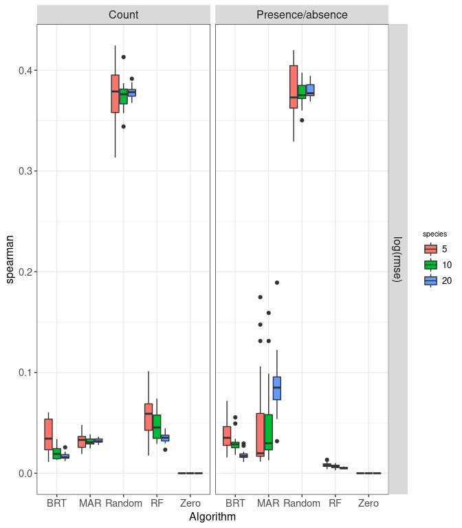

```r
library(tidyverse)
```

```
## ── Attaching packages ─────────────────────────────────────── tidyverse 1.3.0 ──
```

```
## ✓ ggplot2 3.3.5     ✓ purrr   0.3.4
## ✓ tibble  3.1.6     ✓ dplyr   1.0.7
## ✓ tidyr   1.1.4     ✓ stringr 1.4.0
## ✓ readr   2.1.0     ✓ forcats 0.5.1
```

```
## ── Conflicts ────────────────────────────────────────── tidyverse_conflicts() ──
## x dplyr::filter() masks stats::filter()
## x dplyr::lag()    masks stats::lag()
```

```r
library(ggplot2)
```

# A1 


```
## Warning: Removed 120 rows containing non-finite values (stat_boxplot).
```

<!-- -->


# A2 


```
## Warning: Removed 120 rows containing non-finite values (stat_boxplot).
```

<!-- -->


# A3 


```
## Warning: Removed 120 rows containing non-finite values (stat_boxplot).
```

<!-- -->


# A4 


```
## Warning: Removed 120 rows containing non-finite values (stat_boxplot).
```

<!-- -->


# A5

<!-- -->

